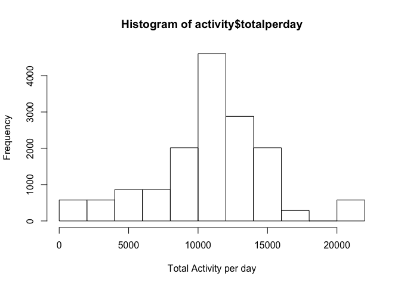

# Reproducible Research: Peer Assessment 1

## Loading and preprocessing the data

```r
library(data.table)
```

```
## Warning: package 'data.table' was built under R version 3.1.2
```

```r
activity <- read.csv("activity.csv", header = T)
activity <- data.table(activity)
```


## What is mean total number of steps taken per day?

```
##        steps       date interval totalperday
##     1:    NA 2012-10-01        0          NA
##     2:    NA 2012-10-01        5          NA
##     3:    NA 2012-10-01       10          NA
##     4:    NA 2012-10-01       15          NA
##     5:    NA 2012-10-01       20          NA
##    ---                                      
## 17564:    NA 2012-11-30     2335          NA
## 17565:    NA 2012-11-30     2340          NA
## 17566:    NA 2012-11-30     2345          NA
## 17567:    NA 2012-11-30     2350          NA
## 17568:    NA 2012-11-30     2355          NA
```

 


## What is the average daily activity pattern?

```r
activity[,avgperinterval:= mean(activity$steps, na.rm=T), by=interval]
```

```
##        steps       date interval totalperday avgperinterval
##     1:    NA 2012-10-01        0          NA        37.3826
##     2:    NA 2012-10-01        5          NA        37.3826
##     3:    NA 2012-10-01       10          NA        37.3826
##     4:    NA 2012-10-01       15          NA        37.3826
##     5:    NA 2012-10-01       20          NA        37.3826
##    ---                                                     
## 17564:    NA 2012-11-30     2335          NA        37.3826
## 17565:    NA 2012-11-30     2340          NA        37.3826
## 17566:    NA 2012-11-30     2345          NA        37.3826
## 17567:    NA 2012-11-30     2350          NA        37.3826
## 17568:    NA 2012-11-30     2355          NA        37.3826
```

```r
## Imputing missing values


## Are there differences in activity patterns between weekdays and weekends?
```
