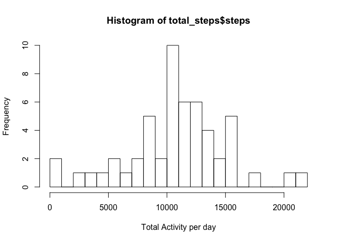

# Reproducible Research: Peer Assessment 1

## Loading and preprocessing the data

```r
library(reshape2)
library(lubridate)
```

```
## Warning: package 'lubridate' was built under R version 3.1.2
```

```r
activity <- read.csv("activity.csv", header = T)
```

## Let's melt the data so that we can calculate total steps per day and average steps across intervals later

```r
melted_days <- melt(activity, id.vars = "date", value.name = "steps")
melted_intervals <- melt(activity, id.vars = "interval", measure.vars="steps", value.name = "steps", na.rm = T)
```
## What is mean total number of steps taken per day?

```
## Using steps as value column: use value.var to override.
```

 

##Lets calculate the mean and median for the total steps


## What is the average daily activity pattern?

```r
average_daily_activity <- dcast(melted_intervals,interval~variable, mean)
```

```
## Using steps as value column: use value.var to override.
```

```r
#Lets plot this so that we can visualize what is the most prominent interval for activities
plot(type="l",y=average_daily_activity$steps, x=average_daily_activity$interval, xlab="5 min interval", ylab="Average Steps Taken")
```

 

##Let's find the interval with the max average daily value

```r
average_daily_activity[which.max(average_daily_activity$steps),]$interval
```

```
## [1] 835
```


## Imputing missing values
###Let's calculate the total number of rows with missing values

```r
length(which(!complete.cases(activity)))
```

```
## [1] 2304
```


###Now we will use a simple recoding. We will take the mean total steps and divide it by 288 and replace the ###NA with this value

```r
meanIntervalSteps <- meanTotalSteps/288
activity_recoded <- activity
activity_recoded$steps[is.na(activity_recoded$steps)] <- meanIntervalSteps
```

###Now we will calculate the total steps and the mean steps using these values

```r
melted_days_recoded <- melt(activity_recoded, id.vars = "date", value.name = "steps")
melted_intervals_recoded <- melt(activity_recoded, id.vars = "interval", measure.vars="steps", value.name = "steps", na.rm = T)
```


```
## Using steps as value column: use value.var to override.
```

 


### We see that there are no differences in the mean and median values when you recode missing values
### However the distribution now has a lot of values at the mean and looks strongly normalized


## Are there differences in activity patterns between weekdays and weekends?
